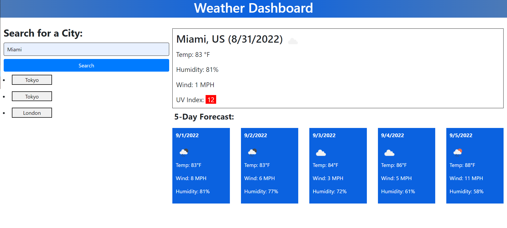

# Weather Dashboard

## Description

This is the Weather Dashboard web application. These files are for review for the Module 6 Challenge.

## Installation

N/A

## Usage

This web app has been created with the following functionality:

1. When searching a city, it shows current weather conditions along with a 5-day forecast.

2. It saves recently searched cities

## Screenshot/Link

[Weather Dashboard](https://cray412.github.io/Weather-Dashboard/)

## Credits

N/A

## License

Please refer to the LICENSE in the repo.